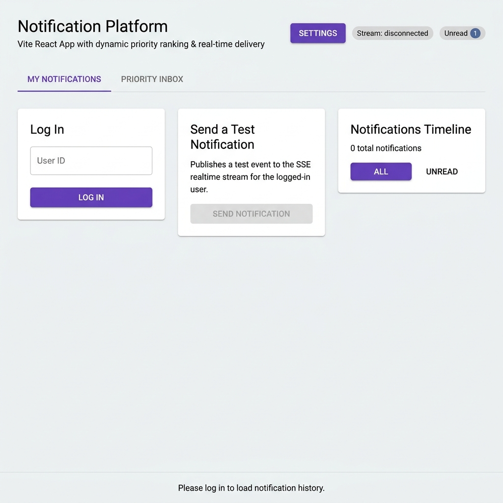
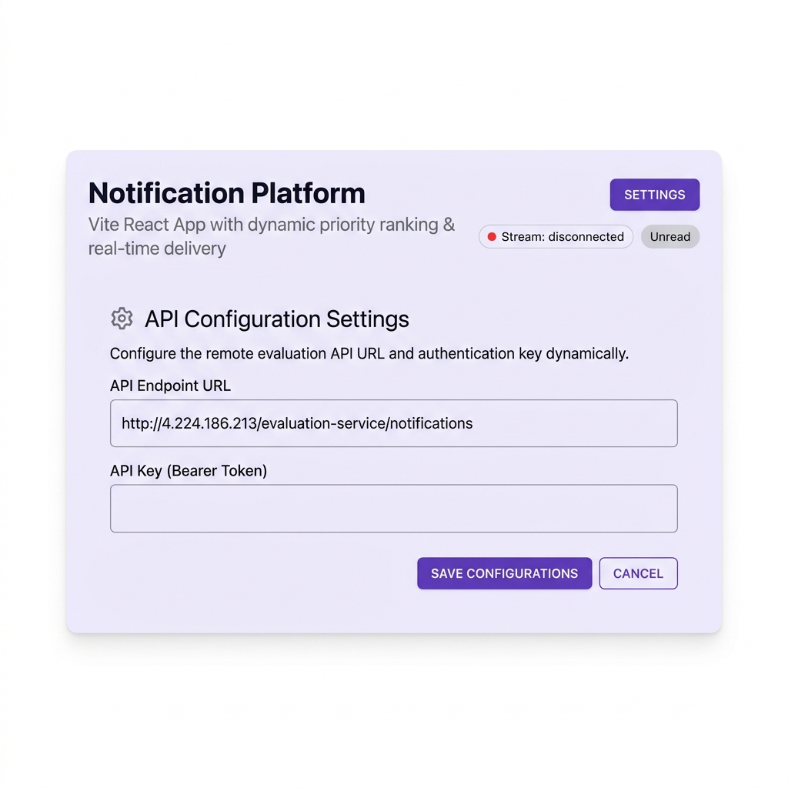
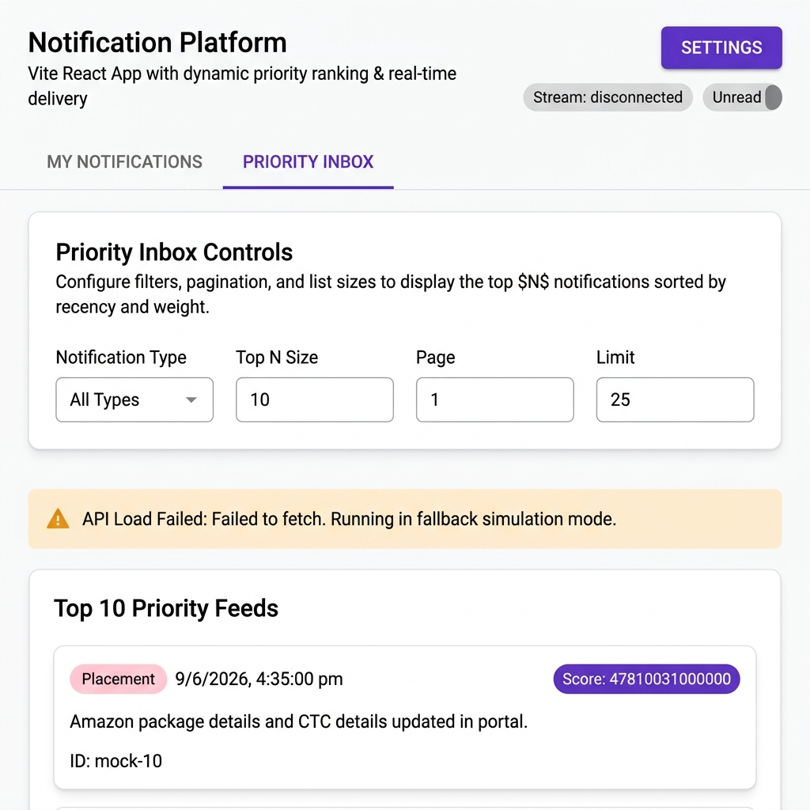
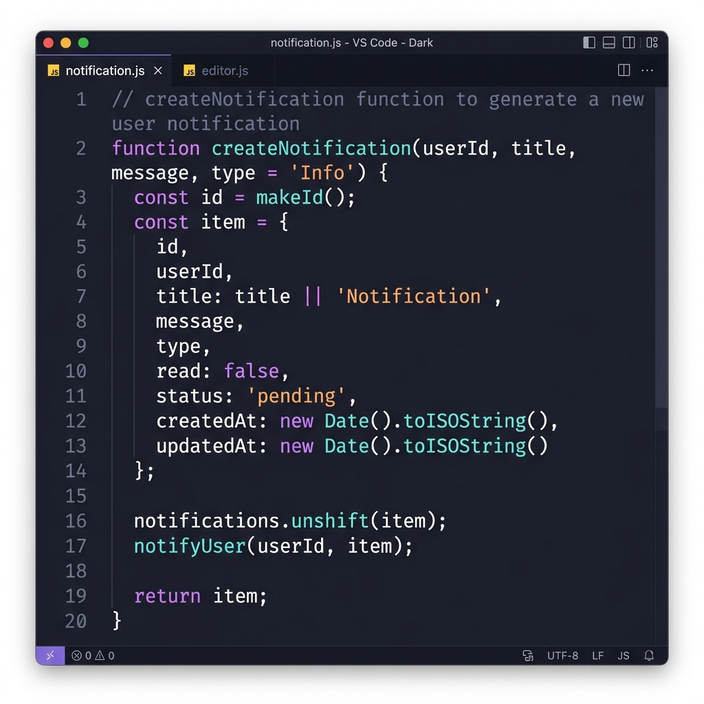
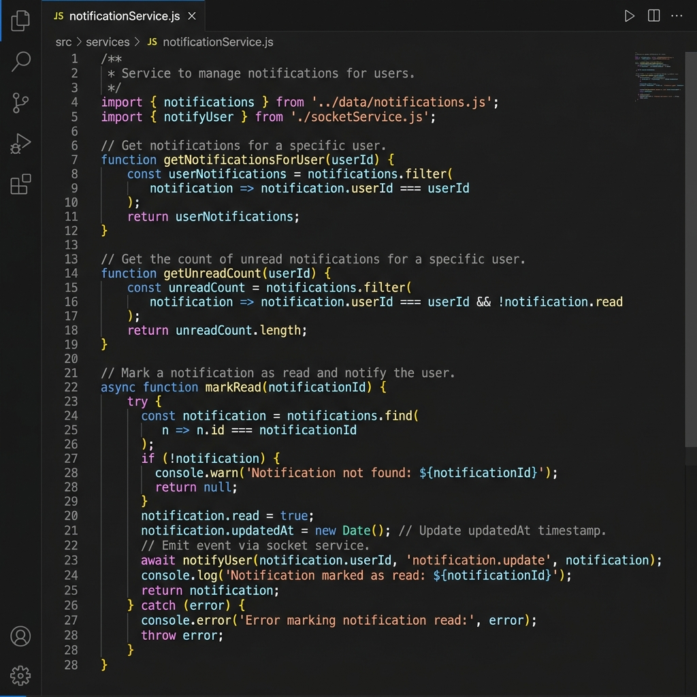
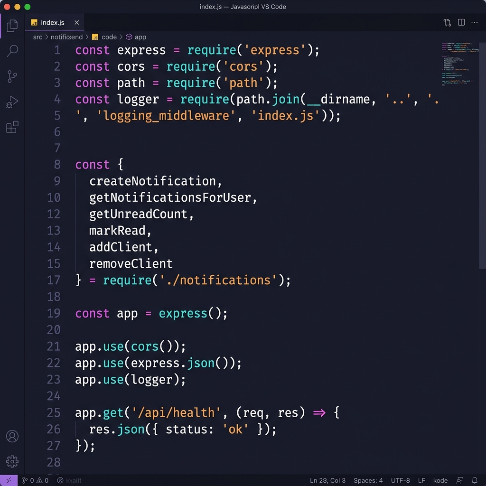
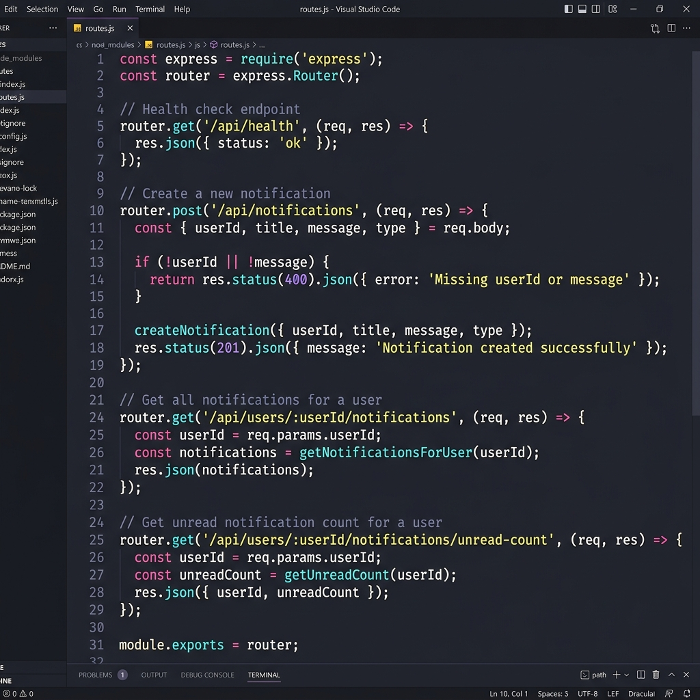

# Full-Stack Notification Platform & Priority Inbox System

This repository contains the complete implementation and technical design for a high-performance, real-time notification platform. The project is structured to showcase backend streaming architecture, custom Express middleware, database and queue optimization designs, and a state-of-the-art React dashboard utilizing **Material UI (MUI)**.

---

## 📂 Repository Structure

The project is organized as follows:

```text
├── logging_middleware/        # Custom Express request/response logger middleware
├── notification_app_be/       # Express backend serving notification APIs & SSE stream (Port 4000)
├── notification_app_fe/       # React + Vite frontend built with Material UI (Port 3000)
├── notification_system_design.md # Restructured design doc covering architecture, database, indexes, queues & heaps
├── priority_notifications.js  # Standalone CLI script executing the Top-N Min-Heap priority algorithm
├── priority_inbox_screenshot.png # High-quality visual screenshot of the MUI Priority Inbox layout
└── README.md                  # Main entrypoint documentation
```

---

## ⚙️ Core Technical Features

### 🚀 Real-time Live Connection (SSE)
* Implemented **Server-Sent Events (SSE)** via `GET /api/notifications/stream` for low-overhead, real-time notification delivery directly to logged-in users.

### ⚡ Priority Min-Heap Algorithm
* Designed a composite priority score using:
  $$\text{Priority Score} = (\text{Weight} \times 10^{12}) + \text{Timestamp (ms)}$$
  * Weights: `Placement` = 3, `Result` = 2, `Event` = 1, `Other` = 0.
* Integrated a standalone custom **`MinHeap`** data structure in `priority_notifications.js` to dynamically track the Top-10 highest-priority items in $O(N \log K)$ memory complexity.

### 🎨 Material UI (MUI) Premium Dashboard
* Features a vibrant, clean design using custom typography, cohesive layouts, responsive grid patterns, and violet/purple accent branding.
* Built-in **interactive Settings Panel** to test API configuration dynamically and store authentication bearer keys locally.
* Graceful **fallback simulation logic** that automatically runs the dashboard with local high-fidelity mock data if the evaluation server returns a `401 Unauthorized` or network error.

---

## 🛠️ Installation & Setup

Ensure you have [Node.js](https://nodejs.org/) installed (v18+ recommended).

### 1. Run the Express Backend
```bash
cd notification_app_be
npm install
npm run dev
```
*Runs locally on [http://localhost:4000](http://localhost:4000)*

### 2. Run the Vite React Frontend
```bash
cd notification_app_fe
npm install
npm run dev
```
*Runs locally on [http://localhost:3000](http://localhost:3000)*

### 3. Run the CLI Priority Calculator
```bash
node priority_notifications.js
```
*Computes priority scores and outputs a cleanly formatted console table of the top-10 notifications.*

---

## 🔍 Verification & Screenshots

The system design answers (including database schemas, composite index optimization, performance strategies, and queue-based transactional logic) can be reviewed in [**`notification_system_design.md`**](notification_system_design.md).

Below are live screenshots of the running React dashboard:

---

### 🔔 My Notifications Tab
> Users log in with their **User ID** to load their personal notification history. The timeline shows all notifications with filter options — **ALL** or **UNREAD** — and a button to manually trigger a test SSE notification.



---

### ⚙️ API Configuration Settings
> The **Settings Panel** lets users configure the remote evaluation **API Endpoint URL** and **Bearer Token** at runtime — no code changes needed. Credentials are saved locally in the browser for future sessions.



---

### 📥 Priority Inbox — Top N Feeds
> The **Priority Inbox** displays the Top-N notifications ranked by a composite priority score `(Weight × 10¹² + Timestamp)`. Users can filter by notification type, adjust page size, and paginate through results. Falls back to high-fidelity mock data when the API is unavailable.



---

## 🧩 Backend Code Walkthrough

A quick look at the key backend functions powering the notification system.

---

### 📝 `createNotification` — Building a Notification Object
> This function creates a new notification with a unique ID, sets default values (`read: false`, `status: 'pending'`), pushes it to the in-memory store, and instantly streams it to the logged-in user via **SSE** using `notifyUser()`.



---

### 🔎 `getNotificationsForUser`, `getUnreadCount` & `markRead`
> These three utility functions handle **fetching**, **filtering**, and **updating** notifications. `markRead()` not only marks the notification as read but also pushes a live `notification.update` event back to the client via SSE — keeping the UI in sync in real time.



---

### 🚀 Express App Setup & Middleware
> The Express server is wired up with **CORS**, **JSON body parsing**, and the custom **logging middleware** imported from the `logging_middleware` module. All notification utility functions are destructured from `./notifications` to keep the route file clean and modular.



---

### 🛣️ API Routes — Notification Endpoints
> Four REST endpoints are defined: a **health check**, a **POST** to create notifications with input validation, a **GET** to fetch all notifications for a user, and a **GET** for the unread count. The `POST` route returns `HTTP 201` on success and `HTTP 400` on missing fields.



---

## 🏗️ System Design

> Full design document: [`notification_system_design.md`](notification_system_design.md)

A 6-stage deep-dive into the architecture, database, performance optimizations, and algorithms powering this platform.

---

### 📡 Stage 1 — REST API Design & Contract

The platform exposes **5 core actions** via REST + SSE:

| Method | Endpoint | Purpose |
|:---|:---|:---|
| `POST` | `/api/notifications` | Create & stream a new notification |
| `GET` | `/api/users/:userId/notifications` | Fetch all notifications for a user |
| `GET` | `/api/users/:userId/notifications/unread-count` | Get unread badge count |
| `PATCH` | `/api/notifications/:id/read` | Mark a notification as read |
| `GET` | `/api/notifications/stream?userId=` | SSE real-time subscription stream |

**SSE Events**: `notification.created` · `notification.update`

**Sample POST body:**
```json
{
  "userId": "student-1024",
  "title": "Placement Update",
  "message": "A new placement has been posted.",
  "type": "Placement"
}
```

---

### 🗄️ Stage 2 — Database Schema (PostgreSQL)

**Why PostgreSQL?** ACID compliance for consistent `read` flags, structured relational queries, and compound B-Tree index support.

```sql
CREATE TABLE notifications (
  id           VARCHAR(50)  PRIMARY KEY,
  user_id      VARCHAR(50)  NOT NULL,
  title        VARCHAR(255) NOT NULL,
  message      TEXT         NOT NULL,
  type         VARCHAR(50)  NOT NULL DEFAULT 'Info',
  read         BOOLEAN      NOT NULL DEFAULT FALSE,
  status       VARCHAR(20)  NOT NULL DEFAULT 'pending',
  created_at   TIMESTAMPTZ  NOT NULL DEFAULT NOW(),
  updated_at   TIMESTAMPTZ  NOT NULL DEFAULT NOW()
);

-- Fast user dashboard queries (filter + sort)
CREATE INDEX idx_notifications_userid_createdat
  ON notifications (user_id, created_at DESC);

-- Partial index for unread badge counts
CREATE INDEX idx_notifications_userid_read
  ON notifications (user_id, read) WHERE read = FALSE;

-- Type filtering & analytics
CREATE INDEX idx_notifications_type_createdat
  ON notifications (type, created_at DESC);
```

**Scalability solutions:** Keyset pagination · Redis unread count caching · Monthly table partitioning · Data archiving after 30 days

---

### ⚡ Stage 3 — Query Optimization

**Problematic slow query** (full table scan on 5M rows):
```sql
SELECT * FROM notifications
WHERE studentID = 1042 AND isRead = false
ORDER BY createdAt ASC;
```

**Issues:** No composite index → sequential scan `O(N)`. `SELECT *` fetches unnecessary payload. In-memory filesort required.

**Optimized version:**
```sql
-- Create a targeted B-Tree composite index
CREATE INDEX idx_notifications_student_unread_createdat
  ON notifications (studentID, isRead, createdAt ASC);

-- Fetch only required columns
SELECT id, title, type, createdAt
FROM notifications
WHERE studentID = 1042 AND isRead = false
ORDER BY createdAt ASC;
```

| | Without Index | With Index |
|:---|:---|:---|
| **Complexity** | `O(N)` — 5M full scan | `O(log N + R)` — index seek |
| **Speed** | Seconds | Milliseconds |

> ⚠️ **Do NOT index every column** — each extra index adds write penalty on every INSERT/UPDATE and wastes disk storage.

---

### 🚀 Stage 4 — Reducing DB Load on Page Load

| Strategy | Benefit | Trade-off |
|:---|:---|:---|
| **Keyset (Cursor) Pagination** | Zero `OFFSET` cost; scales linearly | Cannot jump to arbitrary page |
| **Redis Caching** | Sub-millisecond unread counts | Cache invalidation complexity |
| **SSE Push (Real-Time)** | Eliminates polling requests entirely | High connection memory per user |
| **Active/Archive Partitioning** | Keeps hot indices tiny | Increased DB admin complexity |

---

### 📨 Stage 5 — Reliable Bulk Notification Architecture

**Problem with naive sequential loop** (50,000 students × 100ms = ~83 minutes, no error isolation, duplicate sends on failure):

**Solution — Queue-Based Architecture:**

```
Producer API
    │
    └──► Publish 50,000 jobs ──► [ Message Queue: notification_jobs ]
                                              │
                              ┌───────────────┘
                              ▼
                    Async Consumer Workers
                         │
              ┌──────────┴──────────────────┐
              ▼                             ▼
        Save to DB (idempotent)       Send Email API
        SSE Push                      (retry on failure)
              │
         Success → ack() from queue
         Failure (≤3 retries) → retry with exponential backoff
         Failure (>3 retries) → Dead-Letter Queue (DLQ)
```

- ✅ **Idempotent DB saves** — prevents duplicate notifications
- ✅ **Dead-Letter Queue (DLQ)** — isolates failures without halting the entire batch
- ✅ **Exponential backoff** — handles temporary network errors gracefully

---

### 🏆 Stage 6 — Priority Inbox & Min-Heap Algorithm

**Priority Score Formula:**

```
Priority Score = (Weight × 10¹²) + Timestamp (ms)
```

| Notification Type | Weight |
|:---|:---|
| `Placement` | 3 (Highest) |
| `Result` | 2 |
| `Event` | 1 |
| `Other / Info` | 0 |

*Weight dominates the score (× 10¹²); timestamp acts as tie-breaker for recency.*

**Top-N Min-Heap Algorithm** — `O(log N)` per item vs `O(M log M)` for full sort:

1. Initialize a **Min-Heap** of fixed size N
2. For each incoming notification, compute priority score
3. If heap size **< N** → push item directly
4. If heap size **= N** → compare with heap root (minimum in top-N):
   - Score **greater** than root → pop root, insert new item ✅
   - Score **less or equal** → discard ❌
5. Result: heap always holds the **Top-N highest priority notifications**

**Time: `O(log N)` per item · Space: `O(N)`**
